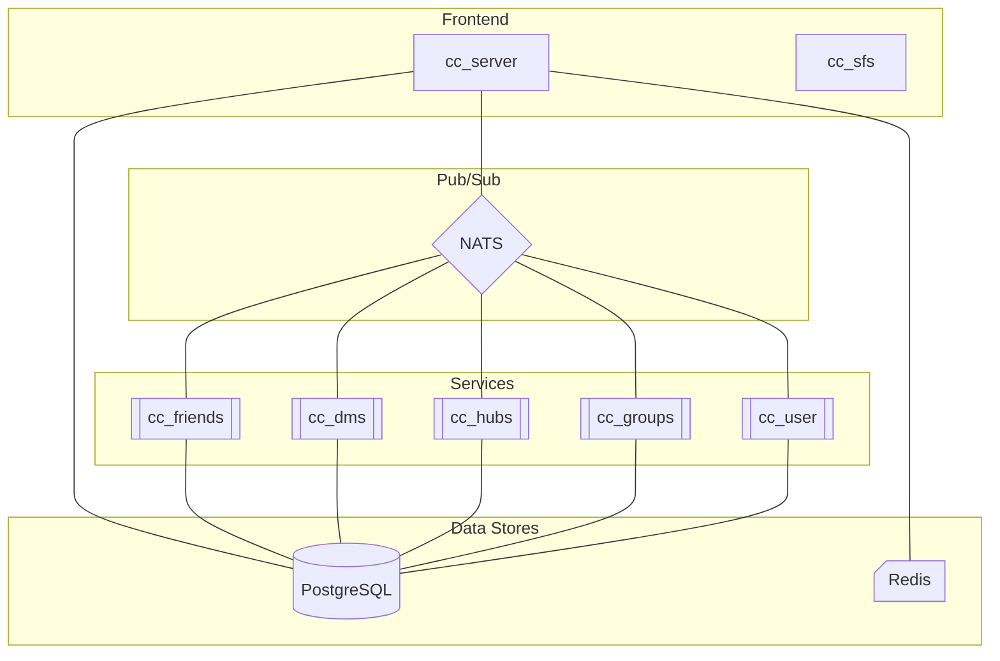

# ChityChat

ChityChat is a simple fullstack chat application originally built as a learning
project. It began as a personal exploration into web development and databases.
Over time, it has grown into a more complex system aimed at expanding my
knowledge in modern software architecture, DevOps, and scalable backend design.

## Project History

The project started as a monolithic application:

-   **Frontend**: Pure JavaScript, HTML, and CSS.
-   **Backend**: A custom web and chat server written in C.
-   **Database**: Initially used SQLite3, later migrated to PostgreSQL.

This was my first attempt at web development, my first web server written in C,
and my first time working with SQL.

In early 2025, I returned to ChityChat as part of a CI/CD learning initiative at
work. While setting up pipelines, I decided to modernize the project and use it
as a platform to learn newer technologies like React.js and Go. The project now
transitions from a monolithic architecture to a hybrid microservice-based
backend.

For clarity:

-   **Version 1 (v1)**: Original app using JS/CSS/HTML and a monolithic C
    backend.
-   **Version 2 (v2)**: Modernized app using React.js, C, and Go in a hybrid
    architecture.

> 🔧 There are still many missing features, planned improvements, and ongoing
> code refactoring in progress. Development is slower now since I sometimes work
> on it in my free time.

---

## Version 1 – Original Design

The initial version featured:

-   Basic group chats: Users could create groups and invite others via access
    codes.
-   Messaging: Text and image messages.
-   API Design: All interactions used a custom WebSocket protocol with
    JSON-formatted messages.

---

## Version 2 – Redesign (In Progress)

> [!NOTE] Version 2 is a work-in-progress. Many features are incomplete or
> unstable.

The new design is inspired by platforms like Discord:

-   **Hubs**: A new concept that allows multiple channels within a single
    server, alongside traditional groups.
-   **Social Features**: Friends, direct messages (DMs), and user profiles.
-   **Tech Stack**:

    -   API design moved from pure WebSockets to a combination of HTTP REST and
        WebSockets.
    -   Backend logic moved into scalable microservices.
    -   Frontend rewritten in React.js.

---

## Backend Design (v2)

ChityChat now uses a hybrid/microservice architecture. The backend consists of
two main layers:

### 1. Frontend Layer

Handles user connections, API routing, and static asset serving.

-   **`cc_server`**: The original C backend, now serves as an API gateway,
    handling authentication, WebSocket connections, and static files.
-   **`cc_sfs`**: A simple file server written in Go for managing user-uploaded
    attachments.

### 2. Backend Services

Handle application logic, written entirely in Go:

-   **`cc_user`** – User account management.
-   **`cc_friends`** – Friends and friend requests.
-   **`cc_dms`** – Direct messages between users.
-   **`cc_groups`** – Group management.
-   **`cc_hubs`** – Hub and channel functionality.

All backend components are prefixed with `cc_`, short for **ChityChat**.

---

## Backend Architecture

**Core components:**

```
Frontend:
  - cc_server
  - cc_sfs

Backend Services:
  - cc_user
  - cc_friends
  - cc_dms
  - cc_groups
  - cc_hubs

Infrastructure:
  - PostgreSQL (relational database)
  - Redis (session management)
  - NATS (message broker)
```



### Flow (Simplified):

1. Client sends an HTTP request to `cc_server`.
2. `cc_server` publishes the request to a NATS topic.
3. A backend service subscribed to that topic receives the request, processes
   it, and replies.
4. `cc_server` forwards the response back to the client.

> ✅ TODO: Add architecture diagram to visually illustrate the backend
> structure.

> ✅ TODO: Add step-by-step guide for building ChityChat and running it on a
> host machine, in a Docker containers, and on Kubernetes.
